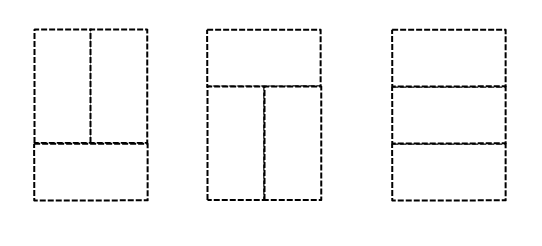
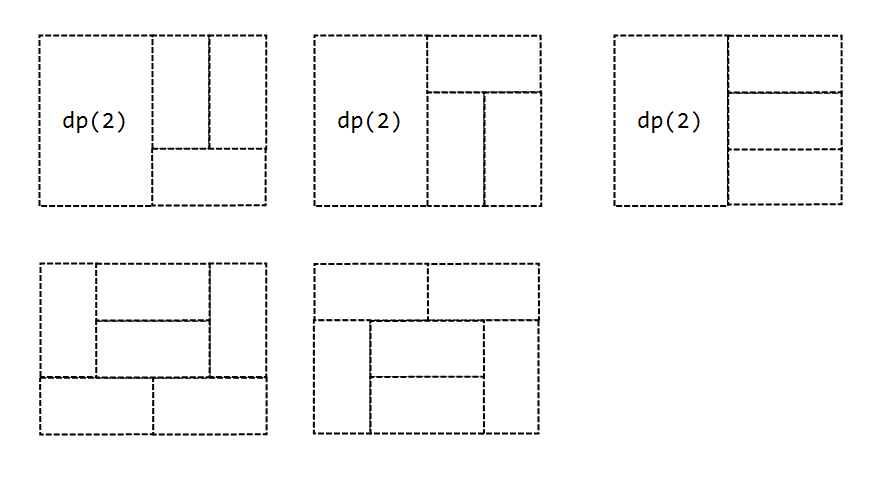
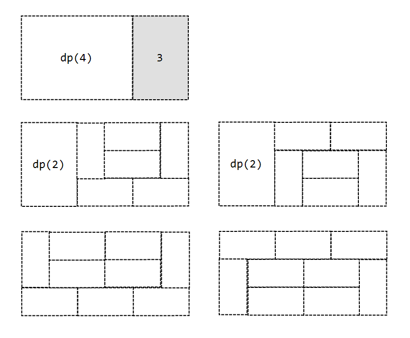
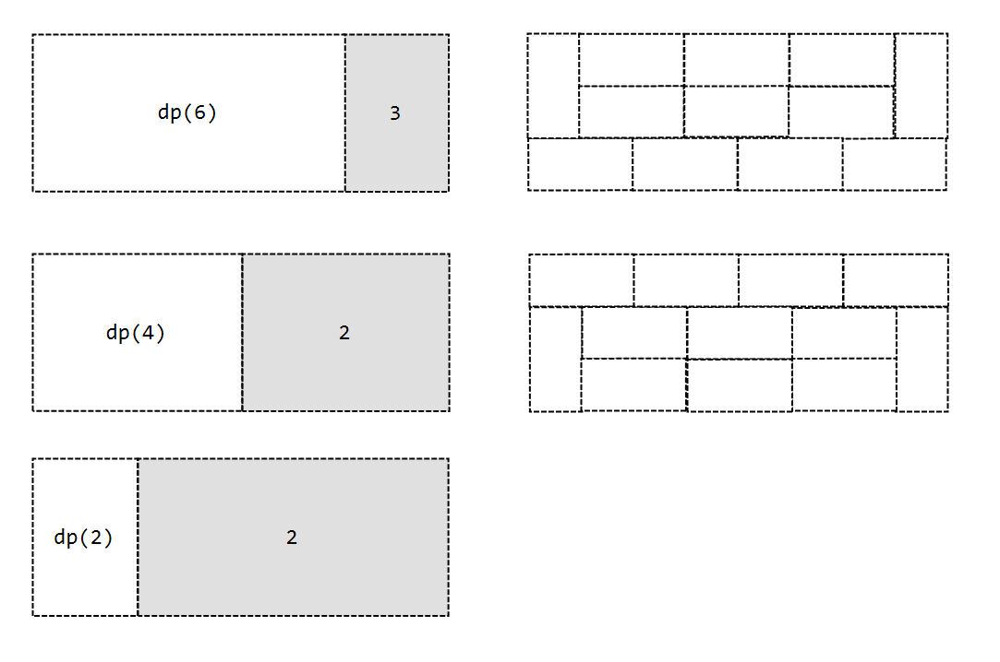

<!-- 다시 한 번 풀 것-->
# 문제 풀이

## 문제 해설

다이나믹 프로그래밍 기법과 모듈러 연산의 분배 법칙을 이용하면 문제를 해결할 수 있다.

### 1. Subproblem

$dp(i)$: 가로 길이가 $i$일 때 타일을 배치하는 경우의 수 

### 2. Relation

$dp(i) = dp(i-2) \times 3 + dp(i-4) \times 2 + ... + dp(2) \times 2 + 2, i \gt 2$

1. $dp(2) = 3$

2. $dp(4) = dp(2) \times 3 + 2$

새로운 도형 2개가 추가되었다.

3. $dp(6) = dp(4) \times 3 + dp(2) \times 2 + 2$

새로운 도형 2개가 추가되었다.

4. $dp(8) = dp(6) \times 3 + dp(4) \times 3 + dp(2) \times 2 + 2$

새로운 도형 2개가 추가되었다.

각 반복마다 이전 반복까지 생성된 모든 도형을 사용하는 경우의 수를 구한 뒤, 새로운 도형 2개를 추가하는 방식이다.

### 3. Topology

`for i in range(2, n + 1)`

### 4. Base case

$dp(2) = 3$

## 시간 복잡도

가로 길이를 $N$이라고 할 때 $O(N^2)$이다.