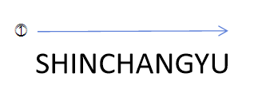
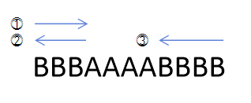
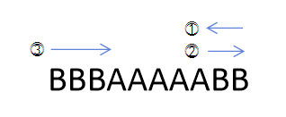

<!--다시 한 번 풀어볼 것-->
# 문제 풀이

## 문제 해설

조이스틱의 조작은 상하 이동과 좌우 이동으로 나뉜다. 상하 이동은 다음과 같이 유니코드 값 차이를 비교해 쉽게 구할 수 있다.

```java
public int change(char c) {
    return Math.min('Z' - c + 1, c - 'A');
}
```

`charge()`는 `char c`가 주어질 때, `A`에서 `char c`로 이동하는데 필요한 최소 상하 조작 횟수를 반환한다.

어려운 점은 좌우 이동이다. 좌우 이동은 다음과 같이 두 가지 경우로 나뉠 수 있다.

1. 시작점에서 오른쪽으로 쭉 이동하는 경우

2. 시작점에서 오른쪽으로 이동하다가 연속된 `A`를 만나 시작점으로 다시 돌아오고 왼쪽으로 이동하는 경우

3. 시작점에서 왼쪽으로 이동했다가 연속된 `A`를 만나 시작점으로 다시 돌아오고 오른쪽으로 이동하는 경우


이를 모두 고려하기 위해서, 좌우 이동 횟수를 의미하는 `leftRight`를 `n - 1`으로 선언한다. 이는 첫 번째 경우가 기본값이라는 것을 의미한다.

```java
int n = name.length();
int leftRight = n - 1;
```

이제, `name`의 각 글자에 대해서 `upDown += change(name.charAt(i))`를 통해 상하 이동 횟수를 계산한다. 그리고 해당 위치로부터 연속된 `A`를 점프한 뒤 해당 위치에서 계속 오른쪽으로 이동하는게 이동하는게 좋을지, 아니면 시작점으로 돌아간 뒤 왼쪽으로 이동하는게 좋을지 `leftRight = Math.min(leftRight, i * 2 + n - index)`를 통해 판단한다. 마찬가지로 반대인 경우도 `leftRight = Math.min(leftRight, (n - index) * 2 + i)`를 통해 판단한다.

```java
for (int i = 0; i < n; i++) {
    upDown += change(name.charAt(i));
    
    int index = i + 1;
    while (index < n && name.charAt(index) == 'A') {
        index += 1;
    }
    
    leftRight = Math.min(leftRight, i * 2 + n - index);
    leftRight = Math.min(leftRight, (n - index) * 2 + i);
}

return upDown + leftRight;
```

정답은 `upDown + leftRight`가 된다.

## 생각할 점

나는 분류도 그리디 문제로 되어있고, 문제를 읽어 봤을 때도 그리디 문제라고 생각해 우선순위 큐를 두어 `A`가 아닌 글자의 위치와 시작점과의 거리를 모두 저장해두고, 하나씩 꺼내며 `upDown`과 `leftRight`를 갱신하고 우선순위 큐 안에 있는 거리들을 새로운 시작점을 기준으로 다시 계산하는 방법을 통해 풀어볼려고 했으나 잘 풀리지 않았었다.. 그리디 문제보다는 투 포인터 문제가 아닌가 싶다.

## 시간 복잡도

이름의 길이를 $n$이라고 할 때, 시간 복잡도는 $O(n)$이다.