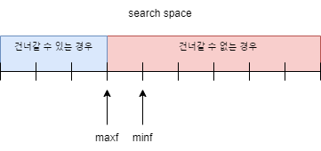

# 문제 풀이

## 문제 해설

처음에는 윷놀이에서 돌을 뭉쳐서 가는 것처럼, 친구를 한 명씩 건너게 하는 것이 아닌 `Integer.MAX_VALUE`명에서 시작해 징검다리를 건너가면서 건너갈 수 없으면 탈락시키는 방식으로 문제를 풀려고 시도했다.

```java
class Solution {
    public int solution(int[] stones, int k) {
        int answer = Integer.MAX_VALUE;
        int n = stones.length;
        
        for (int i = -1; i < n;) {
            int ni = i;
            int s = -1;
            if (i + k >= n) {
                break;
            }
            for (int j = i + 1; j <= i + k; j++) {
                if (stones[j] >= s) {
                    s = stones[j];
                    ni = j;
                }
            }
            if (s < answer) {
                answer = s;
            }
            i = ni;
        }
        
        return answer;
    }
}
```

그러나 위 코드에서 보면 알 수 있겠지만, 징검다리 `i`에서 다음 건너갈 수 있는 징검다리 중 가장 많은 친구들이 건너갈 수 있는 징검다리를 탐색하는 과정을 선형 탐색으로 구현했기 때문에 전체 시간 복잡도는 $O(n^2)$이었다. 그래도 혹시나 하는 마음으로 제출했지만.. 역시나 효율성 검사에서 케이스 하나가 시간 초과가 났었다.

정렬되어 있지 않은 배열에서 최대값을 구하는 방법은 선형 탐색밖에 없기 때문에, 다른 방법으로 시도를 했어야 했다. 그러나 다른 방법은 생각이 떠오르지 않아서 힌트를 살짝 얻은 결과 parametric search로 해결할 수 있다는 힌트를 들었다.

parametric search는 최적화 문제를 결정 문제로 바꿔 푸는 기법으로, 해당 기법을 사용하려면 정답의 범위가 discrete하고 범위가 주어져야 한다. 또한 최대값을 구하는 경우 특정 값이 조건을 만족하면 해당 값보다 미만인 값들도 조건을 만족해야하고, 최소값을 구하는 경우는 그 반대가 되어야 한다.

본 문제는 정답에 대한 search space가 자연수이기 때문에 discrete하고, `stones[i]`의 최소값은 1, 최대값은 $2 \times 10^8$로 주어지고 있다. 또한 친구 수가 $m$일 때 $m$명이 징검다리를 건널 수 없으면, 친구 수가 $m$명보다 작아도 징검다리를 건널 수 없다. 그러므로 본 문제에 parametric search를 충분히 적용할 수 있다!

```java
class Solution {
    public int solution(int[] stones, int k) {
        int n = stones.length;
        int maxf = max(stones);
        int minf = min(stones);

        while (minf <= maxf) {
            // stones를 midf명이 건널 수 있는가?
            int midf = (maxf + minf) / 2;
            int c = 0;
            for (int i = 0; i < n && c < k; i++) {
                if (midf > stones[i]) {
                    c += 1;
                } else {
                    c = 0;
                }
            }
            if (c < k) { // 건널 수 있는 경우
                minf = midf + 1;
            } else { // 건널 수 없는 경우
                maxf = midf - 1;
            }
        }
        
        return maxf;
    }
}
```

parametric search를 수행하면서, 반복마다 친구 수를 `midf`로 두고 징검다리를 `midf`명이 건널 수 있는지 검사를 한다. 전체 `stones`에서 `midf`보다 작은 `stones[i]`가 `k`개 이상 인접한 경우 `midf`명은 `stones`를 건널 수 없다. 이를 `minf <= maxf`가 만족하는 동안 반복하는데, `minf > maxf`가 되는 경우 `maxf`가 정답이 된다. `maxf`가 징검다리를 건널 수 있는 친구 수의 최대값 경계이고, `minf`는 징검다리를 건널 수 없는 친구 수의 최소값이기 때문이다.



## 시간 복잡도
현재 조건 함수는 `stones` 전체를 선형 탐색하고 있기 때문에 $O(n)$임이 자명하다. 정답의 최대 범위를 $max$, 최소 범위를 $min$이라고 할 때 전체 시간 복잡도는 $O(n \times \log({max-min}))$이다.

## 배운 것

최적화 문제를 풀때, 시간 복잡도를 줄일 수 없는 경우 parametric search를 사용할 수 없는지 문제의 조건을 생각해보자. parametric search의 경우 조건 함수만 충분히 빠르다면 최적화 문제를 결정 문제로 바꾸어 빠르게 풀 수 있다.