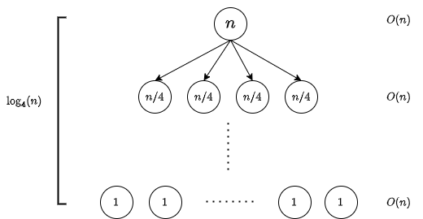

# 문제 풀이

## 문제 해설

본 문제는 분할 정복 문제다.

### 1. Divide

영역 $S$는 2차원 배열 `arr`의 전체에서 시작한다. $S$가 같은 비트로 이루어진지 탐색한다. 같은 비트로 이루어진 경우, `count()`를 한다. 그렇지 않은 경우 영역 $S$를 균일하게 4개의 영역으로 나눈다. 영역 $S$는 크기가 4 이상이면 나눌 수 있다.

### 2. Conquer

영역 $S$의 크기가 1인 경우, 영역 $S$에 존재하는 비트가 모두 동일함은 명백하다.

## 시간 복잡도

전체 영역 $S$의 크기를 $n$이라고 하자. 재귀 트리(Recursion Tree)를 그려보면 문제 크기가 $n$에서 $\frac{n}{4}$가 4개씩 균일하게 나눠지는 구조로 다음과 같다.

이때 재귀 트리의 높이는 $\log_4(n)$이고, 각 노드에서 하는 작업은 영역 $S$가 같은 비트로 이루어진지 탐색하는 것이므로 각 레벨에서 이루어지는 작업의 합은 $O(n)$이다. 그러므로 전체 시간 복잡도는 $O(\log_4(n))$이다.