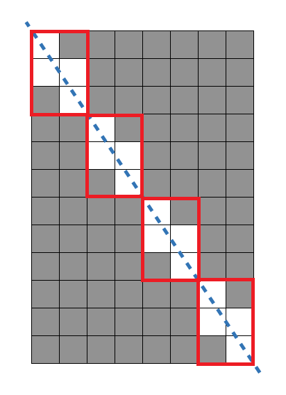

# 문제 풀이

## 문제 해설

위 사진과 같이 대각선을 그었을 때 겹치는 사각형들의 개수 $k$를 구해야 한다. 세로를 $H$, 가로를 $W$라고 했을 때 직선은 $y=\frac{W}{H}x$라고할 수 있다. 또한 위 그림을 보면 특정 패턴이 반복되는 것을 알 수 있다.

해당 패턴의 개수를 $g$라고 하자. $g$는 위 그림에서 알 수 있듯이 $W \mod g \equiv 0$이고, $H \mod g \equiv 0$이다. 즉, $g$는 $W$와 $H$의 공약수라는 것이다. 이때 해당 패턴은 가장 큰 사각형과 동일한 비율의 가장 작은 사각형이다. 그러므로 $g$는 $W$와 $H$의 최대공약수이다.

다음은 패턴 안에만 집중해보자.

이 패턴 안에서만 직선과 겹치는 사각형을 구해보자. 해당 사각형의 세로를 $h$, 가로를 $w$라고 하면 사각형의 개수는 $h + w - 1$이다. 왜냐하면, 맨 왼쪽 상단에서 시작해서 맨 오른쪽 하단으로 도착하기 위해선 세로로 $h$, 가로로 $w$만큼 가야하기 때문이다. 그런데 세로와 가로의 시작점이 겹치기 때문에 $-1$을 해주는 것이다.

정리하자면 제거해야하는 전체 사각형 개수 $k$는 다음과 같다.

$$g = gcd(W, H)$$
$$k = g \times (\frac{W}{g} + \frac{H}{g} - 1) = W + H - g$$

그러므로 정답은 $W \times H - W - H + gcd(W, H)$이다.

## 시간 복잡도

$gcd(W, H)$의 시간 복잡도는 $O(\log(N))$이다.