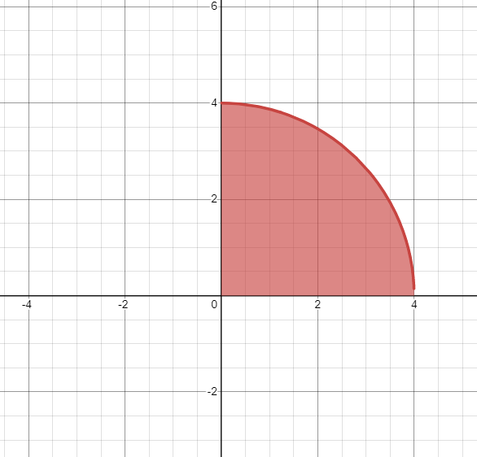

# 문제 풀이

## 문제 해설

진수는 두 양의 정수 $k$, $d$가 주어지면 조건에 따라 점을 찍는다. 이때 $d = 4$라고 하면, 다음 그래프와 같이 제1사분면의 $y = \sqrt{d^2 - x^2}$ 그래프 안의 영역의 점들이 후보가 된다.

이제 해당 영역 안에서, $(a*k, b*k)$인 점들의 개수를 세면 된다. 이는 $(a*k, 0)$과 $(a*k, \sqrt{d^2 - a^2k^2})$ 사이에 $y$ 값이 $k$의 배수인 점들의 개수를 세는 것과 같다. 이는 $\frac{\sqrt{d^2 - a^2k^2}}{k} + 1$개이다. 다만, $+1$을 해주는 이유는 $(a*k, 0)$도 포함해주기 위함이다.

## 시간 복잡도

시간 복잡도는 $O(d/k)$이다.