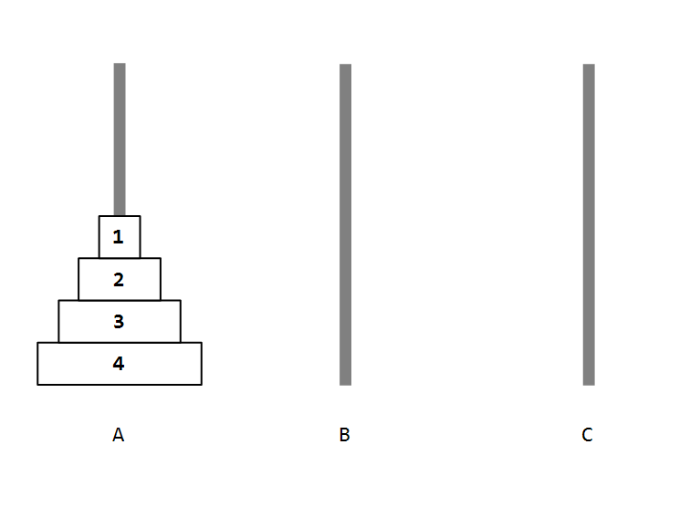
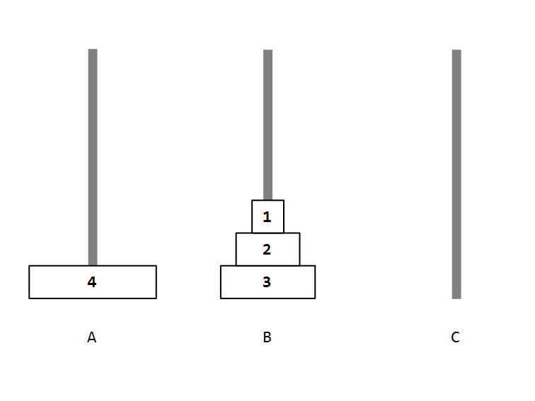
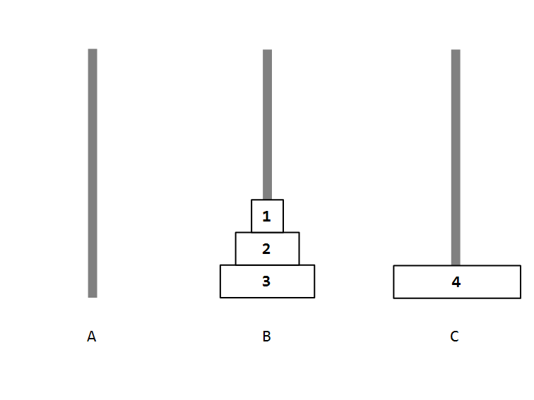
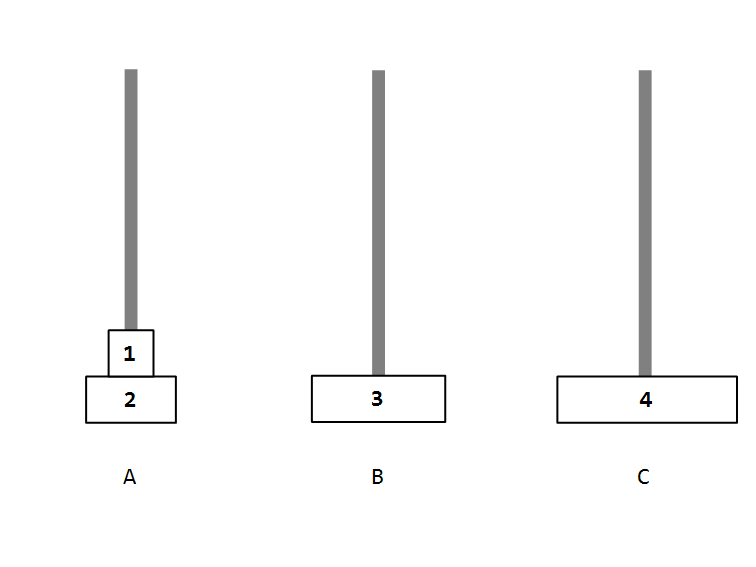
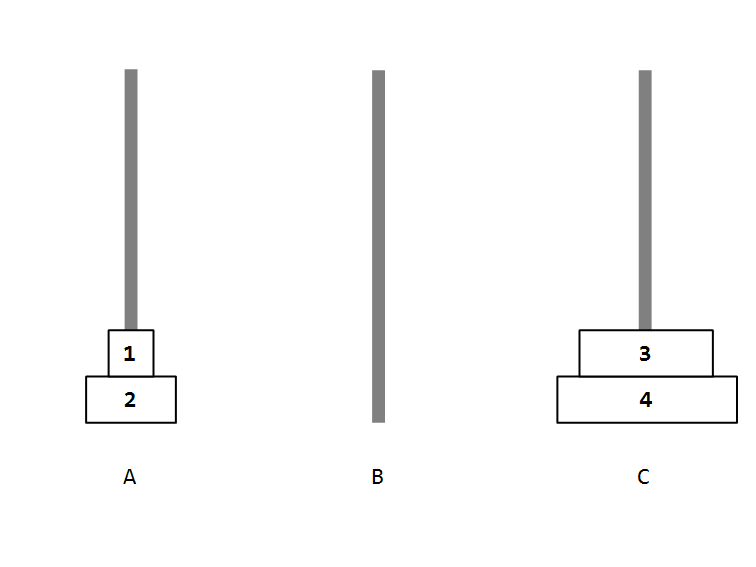
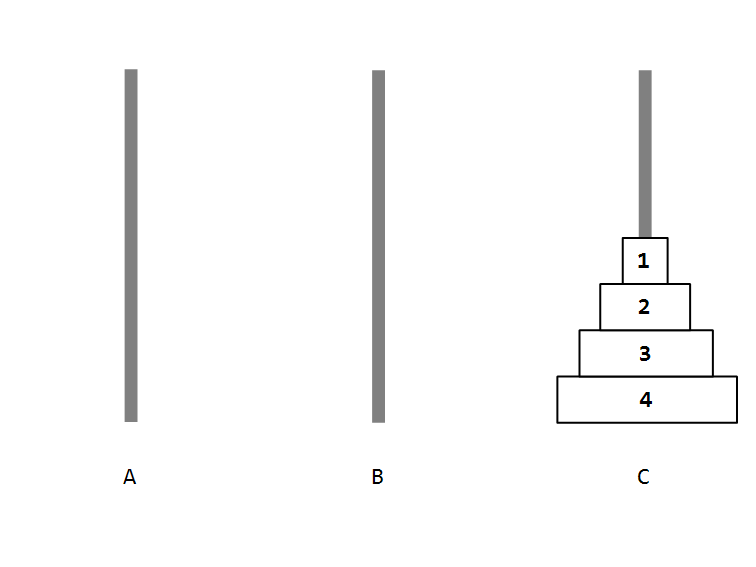

# 문제 풀이

## 문제 해설

하노이의 탑 문제는 다음과 같이 문제를 모델링할 수 있다. $n$개의 원판이 주어졌을 때, 기둥 $A$, $B$, $C$가 있다. 원판 $n$개를 기둥 $A$에서 기둥 $C$까지 최소 횟수로 옮기는 과정을 구해야 한다. 원판은 크기가 큰 원판이 작은 원판 위에 올 수 없으며, 한 번에 하나의 원판만 움직일 수 있다. 처음에 기둥 $A$에 크기가 1인 원판부터 $n$인 원판까지 꽂혀 있다.

마지막 결과를 생각해보면 기둥 $A$에 있는 순서 그대로 원판들이 기둥 $C$에 꽂혀 있어야 한다. 그리고 최소 횟수로 원판을 옮기려면 크기가 가장 큰 원판부터 $C$에 꽂아야 할 것이다. 그러나 해당 원판은 초기에 기둥 $A$의 맨 마지막에 위치하고 있다. 해당 원판을 꺼내기 위해선, 나머지 원판들을 $B$로 모두 옮긴 다음 해당 원판을 기둥 $C$로 옮기면 된다.

예시를 들어보자. $n$은 4이다. 처음에는 다음과 같이 원판이 위치할 것이다.



이제 원판 4를 옮기기 위해 원판 3부터 원판 1까지는 기둥 $B$로 옮겨야 한다.



원판 4를 기둥 $A$에서 기둥 $C$로 옮긴다.



이제 똑같은 작업을 기둥 $B$에 대해서 수행하면 된다. 원판 3을 기둥 $C$로 옮기기 위해 원판 2부터 원판 1까지 기둥 $A$로 옮긴다.



원판 3을 기둥 $C$로 옮긴다.



다시 기둥 $A$에 대해 반복한다. (과정은 생략하겠다.)



최종 결과는 위와 같다.

위 그림을 보다 싶이, 특정 과정이 반복되는 것을 알 수 있다. 가장 큰 원판을 어떤 기둥으로 옮기기 위해 나머지 원판을 다른 기둥으로 옮기고, 해당 원판을 옮긴 다음 같은 과정을 다른 기둥에 대해 반복한다.

$n$개의 원판을 기둥으로 옮기는 함수를 `hanoi()`라고 하자. 그리고, 원판 한 장을 옮기는 함수를 `move()`라고 하겠다.

위 과정을 재귀 함수로 작성하면 다음과 같다.

```java
List<List<Integer>> result = new ArrayList<>();

// 원판 한 장을 from에서 to로 옮긴다.
public void move(int from, int to) {
    result.add(List.of(from, to));
}

//n개의 원판을 from에서 by를 거쳐 to로 옮긴다.
public void hanoi(int n, int from, int by, int to) {
    if (n == 1) {
        move(from, to);
    } else {
        hanoi(n-1, from, to, by);
        move(from, to);
        hanoi(n-1, by, from, to);
    }
}
```

`hanoi()` 함수는 4개의 매개변수를 필요로 한다. `n`은 옮기는 원판 개수를 의미한다. `from`은 시작 기둥, `to`는 도착 기둥, `by`는 중간에 거치는 기둥을 의미한다. 정답을 구하는 호출은 `hanoi(n, 1, 2, 3)`이 될 것이다. 

`move()` 함수는 `from` 기둥에 존재하는 가장 큰 원판을 `to` 기둥으로 옮긴다. 

재귀 함수는 항상 종료 조건, 즉 base case가 필요하다. 이번 경우에는 `n == 1`인 경우다. 원판이 1개 밖에 없으면 곧바로 `to` 기둥으로 옮기면 되기 때문이다.


## 시간 복잡도

재귀식을 작성하면 다음과 같다. $hanoi(n)$은 원판 $n$개를 옮기는데 필요한 연산 횟수다.

$hanoi(n) = \begin{cases} 2\times hanoi(n-1) + 1 (n \gt 1) \\ 1 (n = 1) \end{cases}$

다음과 같이 정리할 수 있다.

1. 양변에 1을 더한다.

$$hanoi(n) + 1 = 2 \times (hanoi(n-1) + 1)$$
$$hanoi(n-1) + 1 = 2 \times (hanoi(n-2) + 1)$$
$$hanoi(n-2) + 1 = 2 \times (hanoi(n-3) + 1)$$
$$\dots$$
$$hanoi(2) + 1 = 2 \times (hanoi(1) +1)$$

2. 양변을 곱한다.

$$(hanoi(n) + 1) \times \dots \times (hanoi(2) + 1) = 2^{n-1} \times (hanoi(n-1) + 1) \times \dots (hanoi(1) + 1)$$

3. 양변에 공통되는 인자를 나눈다.

$$hanoi(n) + 1 = 2^{n-1} \times (hanoi(1) + 1)$$
$$hanoi(n) + 1 = 2^{n}$$

4. 좌변의 $+1$을 우변으로 넘긴다.

$$hanoi(n) = 2^{n} - 1$$

그러므로 전체 시간 복잡도는 $O(2^n)$이다.